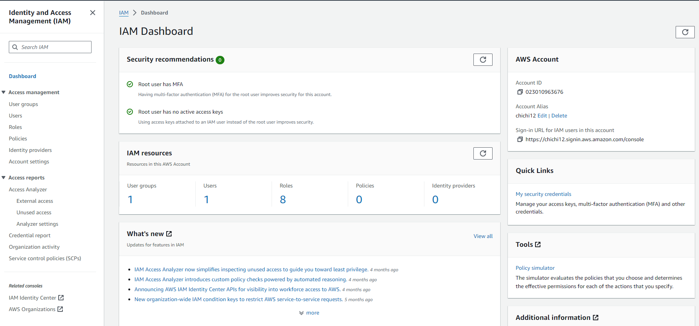

## AWS IAM Project (IAM USER CREATION USING THE AWS CONSOLE)     

- **This project demonstrates how to create an IAM user using the aws console. A user is created and added to a group called admin.**   
- **The group is created prior to adding the IAM user.**  
- **The admin group is granted access to most of the administrative tasks in the organisation.**

### Prerequisites  

Before starting with this guide, ensure you have:

- An active AWS account.
- Basic familiarity with navigating the AWS Management Console.

### Guide Contents  

**Step 1**: Sign In to AWS Management Console

Navigate to the AWS Management Console and sign in with your credentials.  

**Step 2**: Create New IAM User

Go to the IAM dashboard, select "Users", and click "create user".
Provide a username (Plumchy) and select "AWS Management Console access" as the access type.
Set a password and choose whether it requires a reset on first login.  

  

**Step 3**: Create Admin Group and Attach Policies

Choose "Add user to group" and click "Create group".  

Name the group 'admin' and attach the AdministratorAccess policy.   

  

**Step 4**: Add User to Admin Group

Add your new user to the 'admin' group to grant ***administrative access***.  Note that other policies have been attached to user.    

   

   

  

Step 5: Review and Complete  

  
